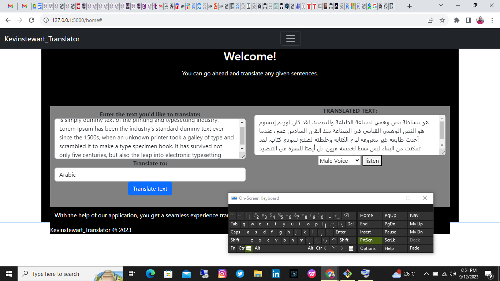

# Kevinstewart Translator


## Introduction

**Kevinstewart Translator** is a powerful language translation web application designed to break down language barriers and facilitate communication across diverse linguistic landscapes. It's your ultimate companion for multilingual conversations.

## The Inspiration Behind KevinStewart Translator
**The Inspiration Behind KevinStewart Translator**

At the heart of the KevinStewart Translator project lies a profound inspiration drawn from the rich cultural tapestry of Nigeria, South Africa and  and the broader African continent. Nigeria, with its diverse ethnicities, languages, and dialects, serves as a microcosm of Africa's linguistic diversity. Africa, as a whole, boasts over 2,000 distinct languages, making it one of the most linguistically diverse regions on the planet.

In Nigeria and south africa where hundreds of languages are spoken, the need for effective communication transcends linguistic boundaries. It's a place where conversations between people from different ethnic backgrounds are marked by the vibrant exchange of ideas, culture, and stories. However, this diversity also poses a unique challenge - the need for a bridge to facilitate these exchanges.

The KevinStewart Translator project aims to be that bridge, built upon the recognition that language should never be a barrier to understanding and unity. It's born out of the vision that technology can empower people to communicate freely, preserving their unique linguistic identities while fostering cross-cultural connections.
 

**Authors:**
- [Kevin Attama](https://www.linkedin.com/in/kevinattamasoftwareengineer)
- [Stewart Nyaruwata](https://www.linkedin.com/in/stewart27/)

**Live Demo:** [Kevinstewart Translator App](link_to_deployed_site)

**Project Blog Article:** [Read Our Blog](https://medium.com/@nyaruwatastewart27/blog-post-b648530b915b)

## Installation

To get started with **Kevinstewart Translator**, follow these simple steps:

1. Clone the repository:

   ```bash
   git clone https://github.com/Attamakevin/kevinstewart_translator.git
   cd kevinstewart_translator
   
2. Install the required dependencies:
   ```pip
   pip install -r requirements.txt
3. Create  a Virtual Environment
   ```
   python3 venv/venv
   source venv/Scripts/activate
### Usage
Kevinstewart Translator is incredibly user-friendly. Here's how you can use it:

Visit the Kevinstewart Translator App.

Sign up for an account or log in if you already have one.

Start translating text or using voice translation - it's that simple!
**The Inspiration Behind KevinStewart Translator**

At the heart of the KevinStewart Translator project lies a profound inspiration drawn from the rich cultural tapestry of Nigeria and the broader African continent. Nigeria, with its diverse ethnicities, languages, and dialects, serves as a microcosm of Africa's linguistic diversity. Africa, as a whole, boasts over 2,000 distinct languages, making it one of the most linguistically diverse regions on the planet.

In Nigeria, where hundreds of languages are spoken, the need for effective communication transcends linguistic boundaries. It's a place where conversations between people from different ethnic backgrounds are marked by the vibrant exchange of ideas, culture, and stories. However, this diversity also poses a unique challenge - the need for a bridge to facilitate these exchanges.

The KevinStewart Translator project aims to be that bridge, built upon the recognition that language should never be a barrier to understanding and unity. It's born out of the vision that technology can empower people to communicate freely, preserving their unique linguistic identities while fostering cross-cultural connections.

**Future Development and the Journey Ahead**

While the current version of KevinStewart Translator is a testament to our commitment to overcoming language barriers, our journey is far from over. We envision a future where our platform evolves into something even more powerful and versatile.

1. **Mobile App**: We're excited about the prospect of designing a mobile app. This app will extend the reach of our translation services, making them accessible on the go, whether you're exploring Nigeria's bustling cities or venturing into Africa's remote landscapes.

2. **Offline Functionality**: Recognizing the importance of reliable communication in regions with intermittent internet connectivity, we plan to implement offline functionality. Our app will allow users to download language packs for offline translation, ensuring they can communicate even when internet access is limited.

3. **Customization**: We understand that language is a deeply personal aspect of identity. To cater to individual preferences, we intend to introduce settings that enable users to customize font sizes, color schemes, and other visual aspects of the app.

4. **Building Our Own APIs**: While we currently rely on external translation APIs, our long-term goal is to develop proprietary translation algorithms. This will enable us to fine-tune our services to the specific linguistic nuances of Nigeria and Africa, providing even more accurate and culturally sensitive translations.

5. **Community and Collaboration**: We see KevinStewart Translator as a tool that fosters collaboration and knowledge sharing. In the future, we aim to create a community of language enthusiasts, linguists, and developers who can contribute to the improvement of our translation services.

6. **Education and Empowerment**: Language is not just a means of communication; it's a key to empowerment. We envision partnerships with educational institutions and organizations to provide language learning resources and support.

7. **Integration with African Languages**: Africa's linguistic diversity is a treasure trove of culture and heritage. We aspire to integrate more African languages into our platform, preserving and celebrating this diversity.

The future of KevinStewart Translator is a journey of exploration, innovation, and collaboration. We invite you to join us on this exciting road ahead, where language is no longer a barrier but a bridge that brings people together in the spirit of understanding and unity.
## Screenshots



## Licensing
Kevinstewart Translator is licensed under the MIT License. See the LICENSE file for details.

